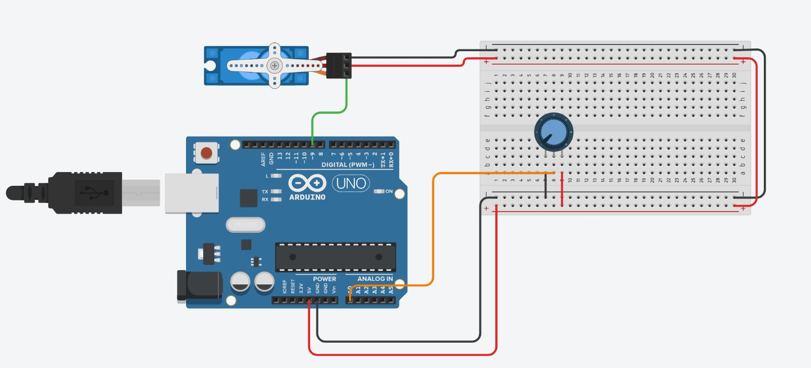

# Arduino Servo Knob Control

## Overview
This project demonstrates how to control a **Servo Motor** using a **Potentiometer (Knob)** and an **Arduino Uno**.

By rotating the knob, the Arduino reads an analog value and maps it to a servo angle, allowing real-time manual control of the servo position.



---

## Components
- Arduino Uno
- Servo Motor
- Potentiometer
- Breadboard
- Jumper Wires

---

## Wiring

### Servo Connections:
- **Red wire (VCC)** → Breadboard **+** or Arduino **5V**
- **Black/Brown wire (GND)** → Breadboard **-** or Arduino **GND**
- **Signal wire** → Digital Pin **9**

### Potentiometer Connections:
- One side pin → **5V**
- Other side pin → **GND**
- Middle pin → Analog Pin **A0**

### Power Distribution:
- Arduino **5V** → Breadboard **+ rail**
- Arduino **GND** → Breadboard **- rail**

---

## Code
```cpp
#include <Servo.h>

Servo myServo;

int potPin = A0;
int potValue = 0;
int angle = 0;

void setup() {
  myServo.attach(9);
}

void loop() {
  potValue = analogRead(potPin);
  angle = map(potValue, 0, 1023, 0, 180);
  myServo.write(angle);
  delay(15);
}
